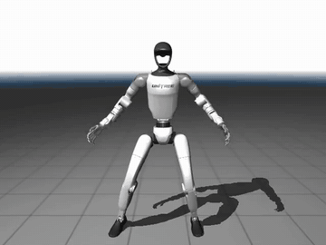
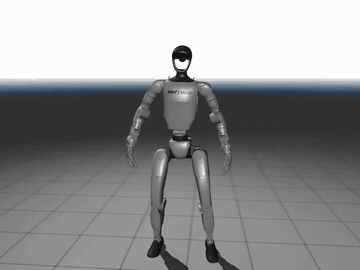
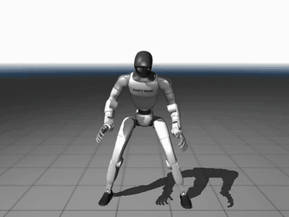
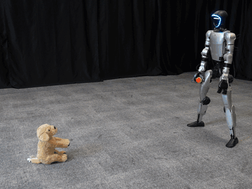

# ScaleBFM

The official implementation of *Scaling Behavior Foundation Model for Humanoid Robots*.

> ScaleBFM investigates how Behavior Foundation Models can be effectively scaled
> through the coordinated design of the learning paradigm, behavioral data, and
> model architecture. The resulting framework enables humanoid robots to perform
> diverse behaviors with natural whole-body coordination, including agile
> locomotion, dexterous manipulation, and coordinated loco-manipulation in both
> simulation and the real world.

<p align="center">
  <a href="https://scalebfm.github.io/"></a>
  <a href="https://arxiv.org/abs/2607.15163"></a>
  <a href="https://github.com/zengweishuai/ScaleBFM/issues"></a>
</p>


## ScaleRetarget

**ScaleRetarget** is the motion-retargeting toolkit used to prepare human motion
data for ScaleBFM. It converts motion from common mocap representations into
robot joint trajectories and currently provides a complete configuration for the
Unitree G1 humanoid.


The retargeting code and documentation are available in
**[ScaleRetarget](ScaleRetarget/README.md)**. See the guide for supported datasets,
environment setup, motion retargeting, dataset preparation, and visualization.

<p align="center">
  
  
  
</p>

## ScaleTrack

**ScaleTrack** provides the foundational implementation of the BFM pretraining
pipeline. It packages retargeted robot trajectories into motion datasets and
pretrains BFMs through motion tracking in IsaacLab using the bundled RSL-RL
implementation. It currently provides a complete pretraining pipeline for the
Unitree G1 humanoid, including single- and multi-GPU training, policy playback, and export.

The training code and documentation are available in
**[ScaleTrack](ScaleTrack/README.md)**. See the guide for environment and robot
asset setup, motion preparation and packaging, policy training, playback, and
export.

<p align="center">
  
  
  
</p>

## ScaleBridge

**ScaleBridge** provides a unified Sim2Sim and Sim2Real deployment framework for
Behavior Foundation Models on humanoid robots. It enables a seamless transition
from policy evaluation in MuJoCo to deployment on physical robots.

The deployment code and documentation are available in
**[ScaleBridge](ScaleBridge/README.md)**. See the guide for environment setup,
robot controller configuration, policy evaluation, real-world deployment, and
migration instructions.

<p align="center">
  
  
  
</p>

## Citation

If you find this work useful, please cite our paper and previous work
that introduced the BFM framework:

```bibtex
@article{zeng2026scaling,
  title   = {Scaling Behavior Foundation Model for Humanoid Robots},
  author  = {Zeng, Weishuai and Yin, Kangning and Niu, Xiaojie and
             Lu, Shunlin and Zhong, Weixiang and Chen, Jiahe and
             Jia, Feiyu and Chen, Xiao and Wang, Zirui and Xu, Furui and
             Zhou, Ming and Li, Kailin and Zhang, Weinan and Wang, He and
             Yi, Li and Lin, Dahua and Pang, Jiangmiao and Wang, Jingbo},
  journal = {arXiv preprint arXiv:2607.15163},
  year    = {2026}
}
```

```bibtex
@article{zeng2025behavior,
  title   = {Behavior Foundation Model for Humanoid Robots},
  author  = {Zeng, Weishuai and Lu, Shunlin and Yin, Kangning and
             Niu, Xiaojie and Dai, Minyue and Wang, Jingbo and Pang, Jiangmiao},
  journal = {arXiv preprint arXiv:2509.13780},
  year    = {2025}
}
```
