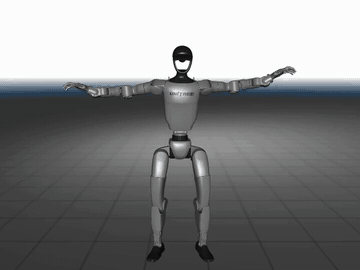
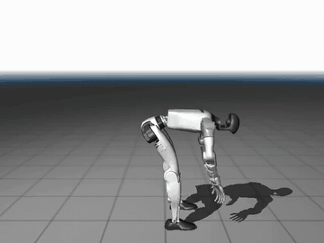
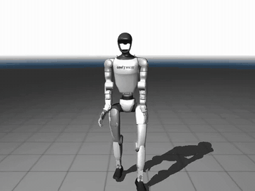
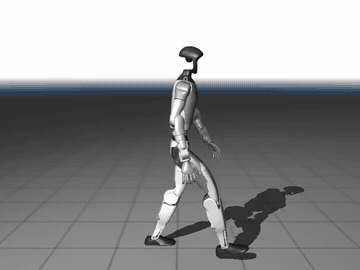
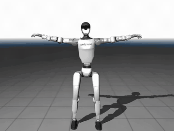
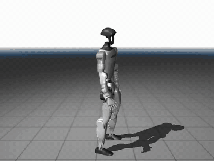
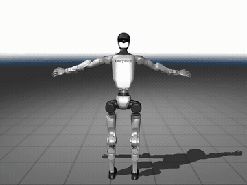
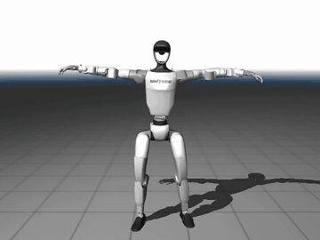
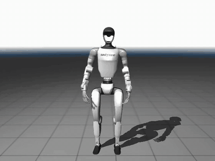
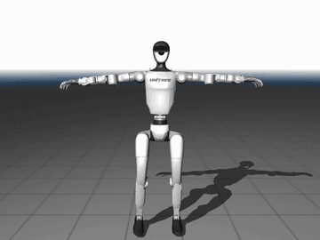

# ScaleRetarget

ScaleRetarget converts human motion from several common motion-capture formats into
robot trajectories through dataset-specific loaders, motion retargeting, and
configurable output formatters.

This guide covers environment setup, dataset preparation, retargeting, and result
visualization. **Run all commands from the ScaleRetarget root.**

> [!IMPORTANT]
> **Feedback and current limitations:** ScaleRetarget supports a large and growing
> collection of datasets, so some edge cases, errors, or missing preparation steps
> may remain. If you encounter a problem or find that any part of the documentation
> is incomplete, please feel free to
> [open an issue](https://github.com/zengweishuai/ScaleBFM/issues).
>
> Some retargeted motions may still exhibit jitter, abrupt changes, floating, or
> unnatural stiffness. We are actively working to improve the overall quality and
> robustness of the retargeting module. In the meantime, we encourage you to try
> other state-of-the-art retargeting methods alongside ScaleRetarget when needed.

## 🧭 Table of contents

- 📚 **[Supported datasets](#supported-datasets)**
  - [Datasets used by ScaleBFM](#scalebfm-datasets)
  - [Additional supported datasets](#additional-datasets)
- 🛠️ **[1. Prepare the environment](#prepare-environment)**
  - [Python environment](#python-environment)
  - [SMPL-X body models](#smplx-models)
- 🔄 **[2. Overview of motion retargeting](#motion-retargeting)**
  - [General command and saving rules](#motion-retargeting)
  - [Optional Hydra parameters](#hydra-parameters)
- 🗂️ **[3. Download and retarget each dataset](#dataset-recipes)**
  - [LAFAN](#lafan1-recipe)
  - [AMASS](#amass-recipe)
  - [OMOMO](#omomo-recipe)
  - [SnapMoGen](#snapmogen-recipe)
  - [FineDance](#finedance-recipe)
  - [Embody3D](#embody3d-recipe)
  - [GRAB](#grab-recipe)
  - [100STYLE](#100style-recipe)
  - [Xsens](#xsens-recipe)
  - [BONES](#bones-recipe)
  - [Mixamo](#mixamo-recipe)
  - [HUMOTO](#humoto-recipe)
  - [GENO](#geno-recipe)
- 🎬 **[4. Visualize retargeted samples](#visualization)**
- 🙏 **[5. Acknowledgements](#acknowledgements)**

<a id="supported-datasets"></a>

## 📚 Supported datasets

The datasets used by ScaleBFM and the additional formats supported by ScaleRetarget
are summarized separately below.

<a id="scalebfm-datasets"></a>

### Datasets used by ScaleBFM

<table>
  <thead>
    <tr>
      <th width="30%" align="center">Dataset</th>
      <th width="70%" align="center">Retargeted preview</th>
    </tr>
  </thead>
  <tbody align="center">
    <tr><td>LAFAN</td><td align="center"></td></tr>
    <tr><td>AMASS</td><td align="center"></td></tr>
    <tr><td>OMOMO</td><td align="center"></td></tr>
    <tr><td>SnapMoGen</td><td align="center"></td></tr>
    <tr><td>FineDance</td><td align="center"></td></tr>
    <tr><td>Embody3D</td><td align="center"></td></tr>
    <tr><td>GRAB</td><td align="center"></td></tr>
    <tr><td>100STYLE</td><td align="center"></td></tr>
    <tr><td>Xsens<br><small>(A motion-capture system used to collect the ScaleBFM test set.)</small></td><td align="center"></td></tr>
    <tr><td>BONES<br><small>(We convert the released Unitree G1 trajectories into our <code>.pkl</code> format. BVH retargeting may be supported in a future release.)</small></td><td align="center"></td></tr>
  </tbody>
</table>

<a id="additional-datasets"></a>

### Additional supported datasets

<table>
  <thead>
    <tr>
      <th width="30%" align="center">Dataset</th>
      <th width="70%" align="center">Retargeted preview</th>
    </tr>
  </thead>
  <tbody align="center">
    <tr><td>Mixamo</td><td align="center"></td></tr>
    <tr><td>HUMOTO</td><td align="center"></td></tr>
    <tr><td>GENO</td><td align="center"></td></tr>
    <tr><td>MotionMillion<br><small>(BVH motions are supported; support for the 272-dimensional representation may be added in a future release.)</small></td><td align="center">Coming soon</td></tr>
  </tbody>
</table>

<a id="prepare-environment"></a>

## 🛠️ 1. Prepare the environment

<a id="python-environment"></a>

###  Python environment

ScaleRetarget requires Python 3.11.

```bash
git clone https://github.com/zengweishuai/ScaleBFM.git
cd ScaleBFM/ScaleRetarget

# Activate your environment with Python 3.11
pip install -e .
```

<a id="smplx-models"></a>

### 🧍 SMPL-X body models

A series of human motion datasets require the licensed
[SMPL-X models](https://smpl-x.is.tue.mpg.de/). Download the neutral, female, and
male models and arrange them as follows:

```text
assets/
└── body_models/
    └── smplx/
        ├── SMPLX_NEUTRAL.pkl
        ├── SMPLX_FEMALE.pkl
        └── SMPLX_MALE.pkl
```

<a id="motion-retargeting"></a>

## 🔄 2. Overview of motion retargeting

The general command is:

```bash
python retarget.py \
  +loader=<dataset> \
  +formatter=<formatter> \
  data_path=</path/to/source_file_or_directory> \
  output_dir=</path/to/output_directory>
```

- `data_path` specifies either one supported motion file or a directory of motions.
  Directories are searched recursively. Quote paths containing spaces, for example
  `data_path="/path/to/my motions"`.

- `loader` selects the dataset-specific parser and preprocessing rules. `lafan` is
  the default, so `+loader=lafan` may be omitted. Available loaders are:
  `lafan`, `amass`, `omomo`, `snapmogen`, `100style`, `finedance`, `embody3d`,
  `grab`, `xsens`, `mixamo`, `humoto`, and
  `geno`.

- `formatter` controls how retargeted joint trajectories are prepared for saving.
  Available formatters are:

  - `base` stores the retargeted root position, root rotation, joint positions, and frame rate without kinematic post-processing. It is the default
    formatter.
  - `kinematic` stores the same fields and additionally adjusts the height of the retargeted motions. The results are not always better with the kinematic formatter.

- `output_dir` selects where retargeted motions are saved. It defaults to
  `retargeted_dataset/` and may be changed explicitly, for example
  `output_dir=/path/to/my_retargeted_motions`.

- Retargeted motions are saved as `.pkl` files according to these rules:

  - For a directory input, the input directory name and its relative hierarchy are
    preserved beneath `output_dir`. For example, `data_path=dataset/lafan1`
    together with `output_dir=retargeted_motions` saves results beneath
    `retargeted_motions/lafan1/`.
  - For a single input file, the result is saved as
    `<output_dir>/<filename>.pkl`.
  - Existing results are skipped by default. Add
    `loader.config.overwrite=true` to replace them.
  - Hydra logs are saved beneath `outputs/`.

<a id="hydra-parameters"></a>

### ⚙️ Optional Hydra parameters

Append optional parameters to the retargeting command as `key=value` arguments.
Boolean values are case-insensitive, so both `true`/`false` and `True`/`False` are
accepted.

| Option | Default | Purpose |
| --- | --- | --- |
| `loader.config.overwrite=true` | `false` | Retarget and replace samples whose output files already exist. |
| `enable_viewer=true` | `false` | Display motions while retargeting. Use this in single-process mode. |
| `multi_process=true` | `false` | Retarget multiple motions concurrently. |
| `num_workers=N` | `null` | Set the number of worker processes when `multi_process=true`. If omitted, ScaleRetarget uses the smaller of the CPU count and the number of motions. |

For example, retarget a directory with concurrent workers:

```bash
python retarget.py \
  +loader=<dataset> \
  +formatter=<formatter_type> \
  data_path=<path_to_the_directory> \
  multi_process=True
```

To display a motion while retargeting it, keep multiprocessing disabled:

```bash
python retarget.py \
  +loader=<dataset> \
  +formatter=<formatter_type> \
  data_path=<path_to_files_or_directories> \
  enable_viewer=True
```

> [!NOTE]
> **Live visualization:** The viewer displays the retargeted trajectory before the
> kinematic formatter applies its height adjustment. Depending on the source
> motion's centering, global translation, and ground-height alignment, the robot may
> therefore appear above or below the ground in the live viewer. This does not
> necessarily reflect the height-adjusted motion saved by the kinematic formatter.


<a id="dataset-recipes"></a>

## 🗂️ 3. Download and retarget each dataset

Below are detailed recipes for curating and retargeting each supported dataset.

<a id="lafan1-recipe"></a>

### 🎞️ LAFAN

1. **Download the source data.** Download
   [`lafan1.zip`](https://github.com/ubisoft/ubisoft-laforge-animation-dataset/blob/master/lafan1/lafan1.zip).

2. **Extract and prepare.** Extract the BVH files into this structure:

    ```text
    dataset/lafan1/
    ├── aiming1_subject1.bvh
    └── ...
    ```

3. **Retarget.** Choose sequential or concurrent processing:

   - **Sequential:** process one motion at a time.
        ```bash
        python retarget.py \
        data_path=dataset/lafan1
        ```

   - **Concurrent:** process several motions in parallel. `num_workers` is optional;
     omit it to use the smaller of the CPU count and the number of motions.

        ```bash
        python retarget.py \
        data_path=dataset/lafan1 \
        multi_process=True
        ```

<a id="lafan1-g1-release"></a>

#### Alternative: use the pre-retargeted G1 release

The LAFAN1 Retargeting Dataset also provides motions that have already been
retargeted to the Unitree G1. Use the conversion utility to package these CSV files
in ScaleRetarget's `.pkl` format; do not run `retarget.py` on them again.

1. **Download the source data.** Download the CSV files from the
   [`g1` directory on Hugging Face](https://huggingface.co/datasets/lvhaidong/LAFAN1_Retargeting_Dataset/tree/main/g1).

2. **Extract and prepare.** Place all downloaded CSV files directly in one folder:

    ```text
    dataset/lafan_g1/
    ├── <motion_name>.csv
    └── ...
    ```

3. **Convert to ScaleRetarget format.** Run:

    ```bash
    python scaleretarget/utils/convert_lafan_hf_to_ours.py \
      dataset/lafan_g1 \
      retargeted_dataset/lafan
    ```


<a id="amass-recipe"></a>

### 🎞️ AMASS

1. **Download the source data.** Download the **SMPL-X** release from
   [AMASS](https://amass.is.tue.mpg.de/). Do not download the SMPL+H release.

2. **Extract and prepare.** Extract all desired subsets beneath `dataset/amass/`
   while retaining their original hierarchy:

    ```text
    dataset/amass/
    ├── ACCAD/
    │   └── Female1General_c3d/
    │       └── A1_-_Stand_stageii.npz
    └── ...
    ```

3. **Retarget.** Choose sequential or concurrent processing:

   - **Sequential:** process one motion at a time.

        ```bash
        python retarget.py \
          +loader=amass \
          +formatter=kinematic \
          data_path=dataset/amass
        ```

   - **Concurrent:** process several motions in parallel.

        ```bash
        python retarget.py \
          +loader=amass \
          +formatter=kinematic \
          multi_process=True \
          data_path=dataset/amass
        ```

<a id="omomo-recipe"></a>

### 🎞️ OMOMO

1. **Download the source data.** Download the
   [original OMOMO archive](https://drive.google.com/file/d/1tZVqLB7II0whI-Qjz-z-AU3ponSEyAmm/view?usp=sharing).

2. **Extract and prepare.** Extract the archive to `dataset/omomo_orig/`:

    ```text
    dataset/omomo_orig/
    ├── captured_objects/
    ├── train_diffusion_manip_seq_joints24.p
    ├── test_diffusion_manip_seq_joints24.p
    └── ...
    ```

    Convert the train and test motions into the loader's expected SMPL-X-style files:

    ```bash
    python scaleretarget/utils/convert_omomo_to_smplx.py \
    dataset/omomo_orig dataset/omomo
    ```

    The prepared directory will contain one `.pkl` file per sequence:

    ```text
    dataset/omomo/
    ├── <sequence_name>.pkl
    └── ...
    ```

3. **Retarget.** OMOMO supports both sequential and concurrent processing, as
   demonstrated for LAFAN1 and AMASS above. We omit the repeated details here and
   show the default sequential command:

    ```bash
    python retarget.py +loader=omomo +formatter=kinematic data_path=dataset/omomo
    ```

<a id="snapmogen-recipe"></a>

### 🎞️ SnapMoGen

1. **Download the source data.** Download `renamed_bvhs.zip` from
   [SnapMoGen on Hugging Face](https://huggingface.co/datasets/Ericguo5513/SnapMoGen/tree/main).

2. **Extract and prepare.** Extract its BVH files as follows:

    ```text
    dataset/snapmogen/
    ├── dd_00000.bvh
    ├── dd_00001.bvh
    └── ...
    ```

3. **Retarget.** SnapMoGen supports both sequential and concurrent processing, as
   demonstrated for LAFAN1 and AMASS above. We omit the repeated details here and
   show the default sequential command:

    ```bash
    python retarget.py +loader=snapmogen +formatter=kinematic data_path=dataset/snapmogen
    ```

<a id="finedance-recipe"></a>

### 🎞️ FineDance

1. **Download the source data.** Follow the
   [FineDance download instructions](https://github.com/li-ronghui/FineDance).

2. **Extract and prepare.** Extract the archive's `motion` directory and place or
   rename it as `dataset/finedance/`:

    ```text
    dataset/finedance/
    ├── 001.npy
    ├── 002.npy
    └── ...
    ```

3. **Retarget.** FineDance supports both sequential and concurrent processing, as
   demonstrated for LAFAN1 and AMASS above. We omit the repeated details here and
   show the default sequential command:

    ```bash
    python retarget.py +loader=finedance +formatter=kinematic data_path=dataset/finedance
    ```

<a id="embody3d-recipe"></a>

### 🎞️ Embody3D

1. **Download the source data.** Follow the
   [Embody3D download instructions](https://github.com/facebookresearch/embody-3d#download-data).

2. **Extract and prepare.** Place all subset directories beneath
   `dataset/embody3d/`. Retain the subset, capture, and subject hierarchy. Each
   subject should retain its SMPL-X coefficient folders:

    ```text
    dataset/embody3d/
    └── <subset_name>/
        └── <capture_name>/
            └── <subject_name>/
                ├── smplx_mesh_body_pose/
                ├── smplx_mesh_global_orient/
                ├── smplx_mesh_left_hand_pose/
                ├── smplx_mesh_right_hand_pose/
                └── smplx_mesh_transl/
    ```

    Gather those coefficients into `.pkl` motion files:

    ```bash
    python scaleretarget/utils/gather_embody3d.py \
    dataset/embody3d dataset/embody3d_smplx
    ```

    ```text
    dataset/embody3d_smplx/
    └── <subset_name>/
        └── <capture_name>/
            ├── <subject_name>.pkl
            └── ...
    ```

3. **Retarget.** Embody3D supports both sequential and concurrent processing, as
   demonstrated for LAFAN1 and AMASS above. We omit the repeated details here and
   show the default sequential command:

    ```bash
    python retarget.py +loader=embody3d +formatter=kinematic data_path=dataset/embody3d_smplx
    ```

<a id="grab-recipe"></a>

### 🎞️ GRAB

1. **Download the source data.** Download [GRAB](https://grab.is.tue.mpg.de/).

2. **Extract and prepare.** Extract it with the official GRAB unpack script and
   retain its subject hierarchy:

    ```text
    dataset/grab_orig/
    ├── grab/
    │   ├── s1/
    │   └── s2/
    └── tools/
    ```

    Convert the source `.npz` files into consolidated SMPL-X `.pkl` files:

    ```bash
    python scaleretarget/utils/convert_grab_to_smplx.py \
    dataset/grab_orig dataset/grab
    ```

    ```text
    dataset/grab/
    └── data/
        ├── <subject>_<sequence>.pkl
        └── ...
    ```

3. **Retarget.** GRAB supports both sequential and concurrent processing, as
   demonstrated for LAFAN1 and AMASS above. We omit the repeated details here and
   show the default sequential command:

    ```bash
    python retarget.py +loader=grab +formatter=kinematic data_path=dataset/grab
    ```

<a id="100style-recipe"></a>

### 🎞️ 100STYLE

1. **Download the source data.** Download
   [`100STYLE.zip`](https://drive.usercontent.google.com/download?id=1-Wr0MkBEIk0SkByJaDXt0wUEZevYFBAk&export=download&authuser=0).

2. **Extract and prepare.** Extract the archive beneath `dataset/100STYLE/` and
   retain its style subdirectories:

    ```text
    dataset/100STYLE/
    ├── Aeroplane/
    │   ├── Aeroplane_BR.bvh
    │   └── ...
    ├── Akimbo/
    └── ...
    ```

3. **Retarget.** 100STYLE supports both sequential and concurrent processing, as
   demonstrated for LAFAN1 and AMASS above. We omit the repeated details here and
   show the default sequential command:

    ```bash
    python retarget.py data_path=dataset/100STYLE +loader=100style +formatter=kinematic
    ```

<a id="xsens-recipe"></a>

### 🎞️ Xsens

1. **Obtain the source data.** Xsens is a motion-capture system rather than a
   standalone dataset. You can record your own motions and export them as BVH, or
   download the source BVH files used for the ScaleBFM Ours test set from [Huggingface](https://huggingface.co/WeishuaiZeng/ScaleBFM/tree/main/test_set/Ours_Test_Set).

> [!TIP]
> **Ready-to-use motions:** We also provide the retargeted files in `Ours_Test_Set_retargeted_pkl.zip` on Huggingface. If you only
> need the Unitree G1 trajectories, you can use these files directly and skip the
> BVH preparation and retargeting steps below.

2. **Extract and prepare.** Extract the downloaded archive—or gather your own BVH
   exports—and place all motions beneath `dataset/xsens/`:

    ```text
    dataset/xsens/
    ├── <motion_name>.bvh
    └── ...
    ```

3. **Retarget.** Xsens supports both sequential and concurrent processing, as
   demonstrated for LAFAN1 and AMASS above. We omit the repeated details here and
   show the default sequential command:

    ```bash
    python retarget.py +loader=xsens +formatter=kinematic data_path=dataset/xsens
    ```

<a id="bones-recipe"></a>

### 🎞️ BONES

1. **Download the released trajectories.** Request access to and download the
   Unitree G1 trajectories from the official
   [BONES-SEED release](https://huggingface.co/datasets/bones-studio/seed). These
   motions have already been retargeted to Unitree G1, so this recipe converts
   their storage format rather than running `retarget.py` again.

2. **Extract and prepare.** Extract the G1 archive beneath `dataset/bones/`. Its
   date-based hierarchy should look like this:

    ```text
    dataset/bones/
    └── g1/
        └── csv/
            ├── <date>/
            │   ├── <motion_name>.csv
            │   └── ...
            └── ...
    ```

3. **Convert to the ScaleRetarget format.** Convert the released CSV trajectories
   into `.pkl` files containing `root_pos`, `root_rot`, `dof_pos`, and `fps`:

    ```bash
    python scaleretarget/utils/convert_bones_to_ours.py \
      dataset/bones/g1/csv \
      retargeted_dataset/bones
    ```

   The converter downsamples the released 120 FPS trajectories to 30 FPS, changes
   centimeters to meters and degrees to radians, converts the root Euler angles to
   an `xyzw` quaternion, and preserves the source hierarchy:

    ```text
    retargeted_dataset/bones/
    ├── <date>/
    │   ├── <motion_name>.pkl
    │   └── ...
    └── ...
    ```

   You can then visualize the converted motions directly:

    ```bash
    python visualize.py retargeted_dataset/bones unitree_g1
    ```

> [!NOTE]
> Retargeting support for the separately released BVH motions may be added in a
> future release.


<a id="mixamo-recipe"></a>

### 🎞️ Mixamo

1. **Download the source data.** Download the
   [Mixamo dataset](https://huggingface.co/datasets/jasongzy/Mixamo).

2. **Extract and prepare.** Collect the `.fbx` files from the archive's
   `animation/` directory beneath `dataset/mixamo_fbx/`, then convert them to BVH:

    ```bash
    python scaleretarget/utils/fbx2bvh.py dataset/mixamo_fbx dataset/mixamo
    ```

    ```text
    dataset/mixamo/
    ├── <motion_name>.bvh
    └── ...
    ```

3. **Retarget.** Mixamo supports both sequential and concurrent processing, as
   demonstrated for LAFAN1 and AMASS above. We omit the repeated details here and
   show the default sequential command:

    ```bash
    python retarget.py +loader=mixamo +formatter=kinematic data_path=dataset/mixamo
    ```

<a id="humoto-recipe"></a>

### 🎞️ HUMOTO

1. **Download the source data.** Download
   [HUMOTO](https://github.com/adobe-research/humoto).

2. **Extract and prepare.** Extract the downloaded FBX motions beneath
   `dataset/humoto_fbx/`, retaining the original sequence directories:

    ```text
    dataset/humoto_fbx/
    ├── baking_with_spatula_mixing_bowl_and_scooping_to_tray-244/
    │   └── <motion_name>.fbx
    ├── carry_organizer_with_both_hands_at_chest_height-436/
    │   └── <motion_name>.fbx
    └── ...
    ```

   Convert all FBX motions to BVH:

    ```bash
    python scaleretarget/utils/fbx2bvh.py dataset/humoto_fbx dataset/humoto
    ```

   The converted motions will have this structure:

    ```text
    dataset/humoto/
    ├── <motion_name>.bvh
    └── ...
    ```

3. **Retarget.** HUMOTO supports both sequential and concurrent processing, as
   demonstrated for LAFAN1 and AMASS above. We omit the repeated details here and
   show the default sequential command:

    ```bash
    python retarget.py +loader=humoto +formatter=kinematic data_path=dataset/humoto
    ```

<a id="geno-recipe"></a>

### 🎞️ GENO

1. **Download the source data.** Download the BVH retargeting releases published
   through [Orange Duck's projects](https://github.com/orangeduck), such as Motorica and Zeroeggs.

2. **Extract and prepare.** Place each release beneath `dataset/geno/` while
   retaining its directory structure:

    ```text
    dataset/geno/
    ├── motorica-retarget/
    ├── zeroeggs-retarget/
    └── ...
    ```

3. **Retarget.** GENO supports both sequential and concurrent processing, as
   demonstrated for LAFAN1 and AMASS above. We omit the repeated details here and
   show the default sequential command:

    ```bash
    python retarget.py +loader=geno +formatter=kinematic data_path=dataset/geno
    ```

<a id="visualization"></a>

## 🎬 4. Visualize retargeted samples

Pass either one retargeted `.pkl` file or a directory of files, followed by the
robot configuration name:

```bash
python visualize.py <path_to_a_retargeted_file_or_directory> unitree_g1
```

Interactive controls:

| Key | Action |
| --- | --- |
| `Space` | Pause or resume playback |
| `R` | Restart the current motion |
| `S` | Switch to the next motion when viewing a directory |
| `C` | Toggle camera following |

Record a sample directly to a video (playback exits after one loop):

```bash
python visualize.py <path_to_a_retargeted_sample> unitree_g1 \
  --record-video --video-path videos/output.mp4
```

<a id="acknowledgements"></a>

## 🙏 5. Acknowledgements

We sincerely thank [kevinzakka/mink](https://github.com/kevinzakka/mink) and
[YanjieZe/GMR](https://github.com/YanjieZe/GMR) for their excellent open-source
work and contributions to the motion-retargeting community.
